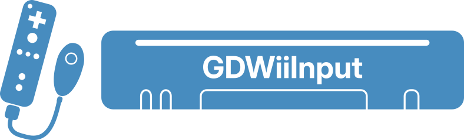

  

> **Supported Platforms:** Windows & Linux with **Godot 4.4+**

**GDWiiInput** is a Godot interface for communication with the Wii remote and its accessories, powered by [Wiiuse](https://github.com/wiiuse/wiiuse). Contributions are welcome!

[![][docs-stable-img]][docs-stable-url] [![][asset-lib-img]][asset-lib-url] 

[docs-stable-img]: https://img.shields.io/badge/docs-dev-blue.svg
[docs-stable-url]: https://godot-wii-input.readthedocs.io/

[asset-lib-img]: https://img.shields.io/badge/asset_lib-blue.svg
[asset-lib-url]: https://godotengine.org/asset-library/asset/4179

## Features

- **Button Input**: All button presses, including the Nunchuk joystick motion, are routed through Godot's Input system. (Check the demo project to see the mappings)
- **LED Control & Rumble Feedback**: Control the LED lights on the Wiimote and trigger rumble feedback.
- **IR Data**: Access the positions and sizes of upto 4 IR clusters detected by the IR camera.
- **Motion Control**: In addition to access to raw accelerometer and gyroscope data, there are also basic motion control processing utilities from [GamepadMotionHelpers](https://github.com/JibbSmart/GamepadMotionHelpers) (**currently not reliable!**).

## Limitations

- **Third-party accessories** cannot be reliably supported due to the non-standard initialization methods they use.
- **Controllers cannot be added/removed mid-session**. This includes Wiimotes and their extensions. Wiiuse assumes all devices are paired and connected at the start of the session, and unfortunately, adding or removing controllers afterward is not supported. While a solution exists using a direct HID layer, this is outside the scope of this project.