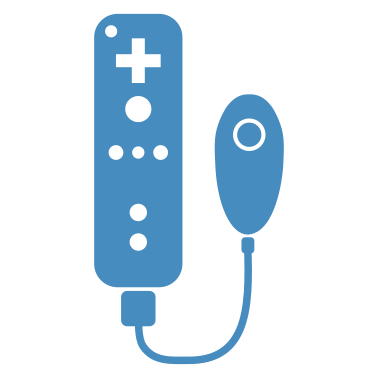

# GDWiiInput – WIP!

<p align="center">
  
</p>

**GDWiiInput** is a Godot (v4.4+) interface for communication with the Wii remote and its accessories, powered by [Wiiuse](https://github.com/wiiuse/wiiuse). This is my first GDExtension and the project is still a work in progress, so any contributions or tips are very welcome!

## Features

- **Button Input**: All button presses, including the Nunchuk joystick motion, are routed through Godot's Input system. (Check the demo project to see the mappings)
- **LED Control & Rumble Feedback**: Control the LED lights on the Wiimote and trigger rumble feedback.
- **Motion Control**: In addition to access to raw accelerometer and gyroscope data, there are also basic motion control processing utilities from [GamepadMotionHelpers](https://github.com/JibbSmart/GamepadMotionHelpers) (**currenly not reliable!**).

### Roadmap

- Gyro-based pointer controls
- Speaker support
- IR data support
- Automatic releases with GitHub Actions

### Wishlist

- Standalone Bluetooth connection without external programs
- MotionPlus attachment support
- Motion board integration
- Better Nunchuk deadzone detection

## Connecting Wiimotes
On linux, the BlueZ bluetooth drivers are required(`sudo apt install libbluetooth3 bluez`).

- **Linux**: After calling `WiimoteManager.connect_wiimotes()`, press 1+2 on the Wiimotes to connect.
- **Windows**: The Bluetooth stack on Windows can be quirky. If you're using a Bluetooth passthrough device like the [Dolphinbar](https://www.mayflash.com/product/W010.html), it should work similarly to Linux. Alternatively, you can use something like [WiiPair](https://github.com/jordanbtucker/WiiPair) or use continuous scanning in [Dolphin Emulator](https://github.com/dolphin-emu/dolphin) to connect the Wiimotes before launching the Godot session. Ideally, a port of whatever Dolphin Emulator uses will be a long-term solution.

Upon successful connection, the LED should light up, and you’ll feel a rumble just like the standard connection with the Wii.

## Compiling the GDExtension

This project is made for Godot 4.4+.

1. Clone the repository:
    ```
    git clone --recursive https://github.com/20akshay00/godot-wii-input
    ```
2. Build the `godot-cpp` bindings:
    ```
    cd godot-wii-input/godot-cpp; scons platform=<platform>; cd ..
    ```
3. Build the `gdwiiinput` extension:
    ```
    scons platform=<platform>
    ```

After this, you should be able to run the demo project in Godot.

## Building Wiiuse
This project builds Wiiuse as a static library as provided in `/libs`. The instructions below are just for reference.

### Linux
The BlueZ bluetooth drivers and dev-files are a dependency that can be installed as follows.
```
sudo apt install libbluetooth-dev libbluetooth3 bluez
```
Wiiuse can then be built with the following flags.
```
cmake -DBUILD_SHARED_LIBS=OFF -DCMAKE_BUILD_TYPE=Release -DCMAKE_POSITION_INDEPENDENT_CODE=ON ..
make
```

### Windows
```
& "C:\Program Files\CMake\bin\cmake.exe" -S .. -B build -DBUILD_SHARED_LIBS=OFF -DCMAKE_BUILD_TYPE=Release -DCMAKE_C_FLAGS_RELEASE="/MT" -DCMAKE_CXX_FLAGS_RELEASE="/MT"
& "C:\Program Files\CMake\bin\cmake.exe" --build build --config Release
```

## Current Limitations

- **No built-in pairing handling for Windows.**
- **Extreme latency in Linux.** Not sure if its just my system or some issue with Wiiuse.
- **Limited hardware testing.** I have a MotionPlus Wiimote and a third-party Nunchuk (no sensor bar), so I can’t test all possible setups.

## Permanent Limitations

- **Third-party accessories** cannot be reliably supported due to the non-standard initialization methods they use.
- **Controllers cannot be added/removed mid-session**. This includes Wiimotes and their extensions. Wiiuse assumes all devices are paired and connected at the start of the session, and unfortunately, adding or removing controllers afterward is not supported. While a solution exists using a direct HID layer, this is outside the scope of this project.

## Why!?

This started as a simple way to get familiar with writing GDExtensions. The Wiimote seemed like a fun target since it's an affordable and accessible motion-centric controller, and it offers a variety of quirky accessories to experiment with.

For modern controllers that largely use motion-controls for aiming, Godot already has a lot of [ongoing work](https://github.com/godotengine/godot-proposals/issues/2829) to improve support. So this isn't meant for serious usage and is more of a nostalgia-driven side project.

### Stuff to check out
- [Wiiuse API](https://wiiuse.net/?nav=api)
