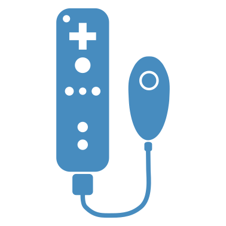

:allow_comments: False
GDWiiInput Documentation
============================

**Supported Platforms:** Windows and Linux (Godot 4.4+)

`GDWiiInput <https://github.com/20akshay00/godot-wii-input>`__ is a GDExtension for the `Godot Engine <https://godotengine.org>`__ that enables communication with Wii Remotes and their accessories using the `Wiiuse <https://github.com/wiiuse/wiiuse>`__ library.

It supports input from the Wiimote, Nunchuk, and Wii Balance Board. Core features include button mapping into Godot’s input system, motion and rumble support, LED control, and access to motion sensors. Contributions are welcome!

Features
============

- **Button Input**: All Wiimote button and joystick inputs (including Nunchuk) are mapped into Godot's input system. See the demo project for mappings.
- **Motion Data**: Access raw accelerometer and gyroscope data. Basic processing is available using `GamepadMotionHelpers <https://github.com/JibbSmart/GamepadMotionHelpers>`__ (experimental).
- **LED & Rumble**: Control the Wiimote’s LEDs and trigger rumble feedback.

Connecting Wiimotes
===========================

On **Linux**, the BlueZ Bluetooth stack is required:

.. code-block:: bash

   sudo apt install libbluetooth3 bluez

- After calling ``WiimoteManager.connect_wiimotes()``, press 1+2 on the Wiimote to pair.
- On **Windows**, pairing can be inconsistent. Devices like the `Mayflash DolphinBar <https://www.mayflash.com/product/W010.html>`__ may work. Alternatively, use tools such as `WiiPair <https://github.com/jordanbtucker/WiiPair>`__ or pair via continuous scanning in the `Dolphin Emulator <https://github.com/dolphin-emu/dolphin>`__.

Once connected, a short rumble and LED light will confirm successful pairing.

Building the GDExtension
===========================

Requirements: Godot 4.4+, Python, SCons, CMake.

1. Clone the repository:

.. code-block:: bash

   git clone --recursive https://github.com/20akshay00/godot-wii-input

2. Build `godot-cpp` bindings:

.. code-block:: bash

   cd godot-wii-input/godot-cpp
   scons platform=<platform>
   cd ..

3. Build the extension:

.. code-block:: bash

   scons platform=<platform>

After this, the demo project should be runnable from the Godot editor.

Wiiuse Compilation
===========================

This project uses Wiiuse as a static library from the `/libs` directory. The steps below are for reference.

**Linux dependencies:**

.. code-block:: bash

   sudo apt install libbluetooth-dev libbluetooth3 bluez

**Build Wiiuse:**

.. code-block:: bash

   cmake -DBUILD_SHARED_LIBS=OFF -DCMAKE_BUILD_TYPE=Release -DCMAKE_POSITION_INDEPENDENT_CODE=ON ..
   make

**Windows build (example using PowerShell):**

.. code-block:: powershell

   & "C:\Program Files\CMake\bin\cmake.exe" -S .. -B build -DBUILD_SHARED_LIBS=OFF -DCMAKE_BUILD_TYPE=Release -DCMAKE_C_FLAGS_RELEASE="/MT" -DCMAKE_CXX_FLAGS_RELEASE="/MT"
   & "C:\Program Files\CMake\bin\cmake.exe" --build build --config Release

Limitations
===========================

**Current:**

- No built-in pairing for Windows.
- High latency on Linux (possibly system-specific).
- Limited hardware testing (only MotionPlus Wiimote and third-party Nunchuk tested).

**Permanent:**

- Third-party accessories may not work reliably due to non-standard protocols.
- Devices cannot be added or removed mid-session—Wiiuse requires all devices to be connected at startup.

Table of Contents
============================

.. Add :hidden: to each to hide them on this page. For now it's better to have them for quick navigation.

.. toctree::
   :maxdepth: 2
   :caption: Class Reference
   :name: sec-class-ref

   classes/class_gdwiimote
   classes/class_wiimotemanager
